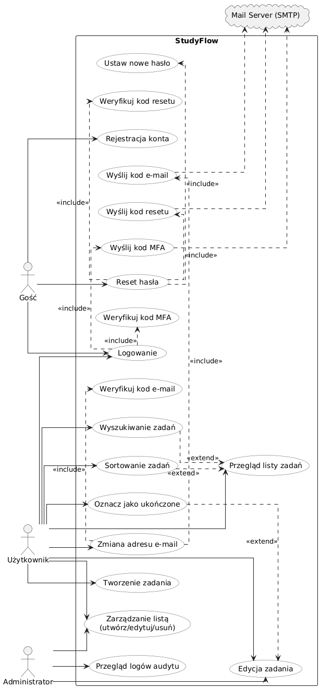
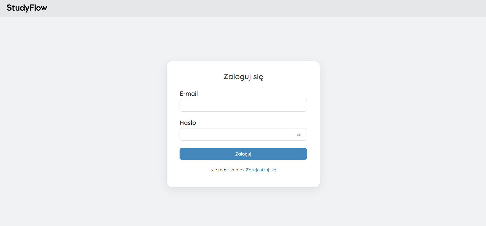
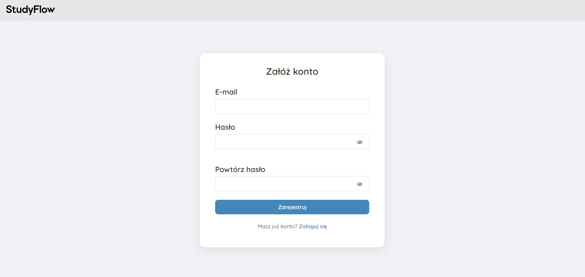
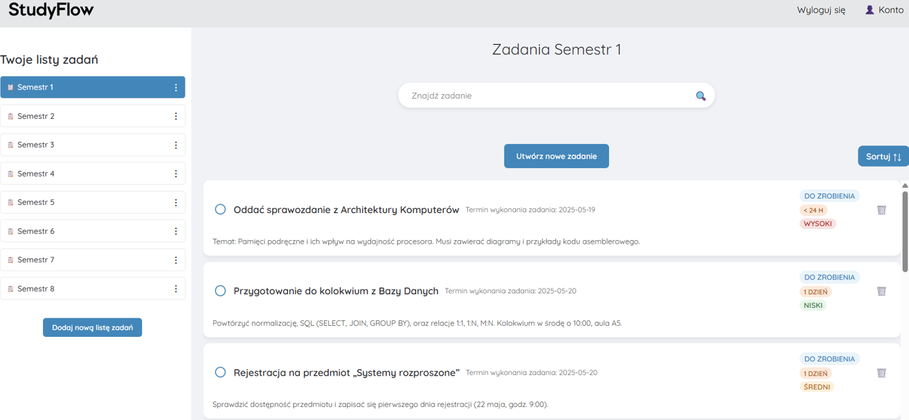
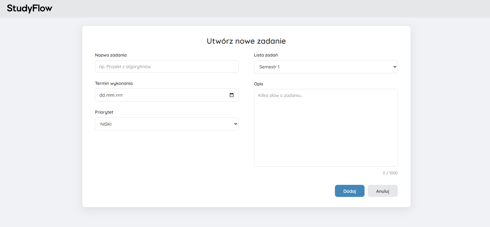
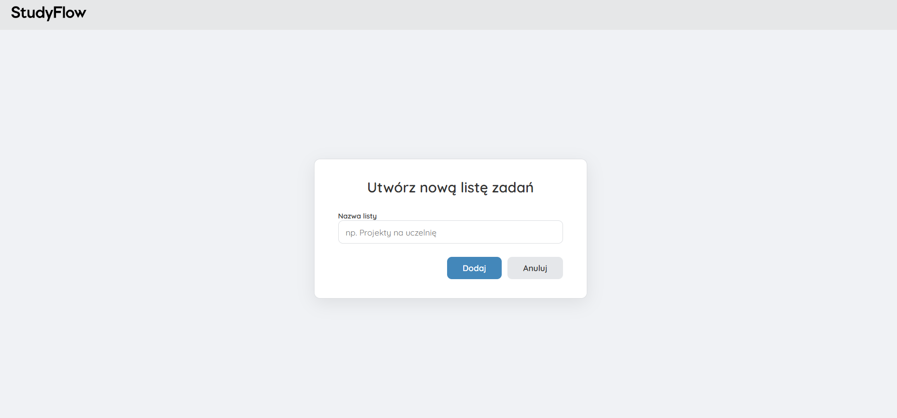
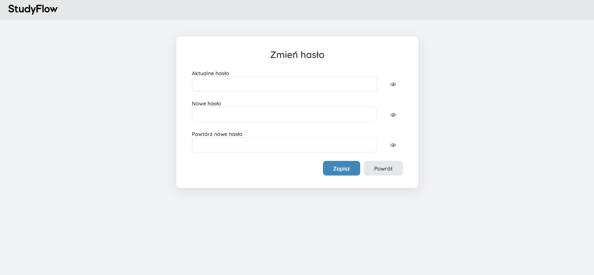

<p align="center">

</p>

# StudyFlow

Welcome to "StudyFlow" - a  platform designed to help you organize and track your tasks effortlessly, whether for personal projects or team assignments. StudyFlow ensures you stay productive and on top of your work!


# Features
- Task List Management: Create and manage multiple task lists effortlessly.
- Task Details: Each task includes information such as name, description, due date, and status.
- User Authentication: Secure account creation and management for handling your tasks.
- REST API: Perform CRUD operations on tasks and task lists via a RESTful API.
- API Documentation: Interactive API documentation using Swagger (Springdoc OpenAPI).

# Technologies

Front-End:
- HTML, CSS, JavaScript
- Thymeleaf (templating engine)

Back-End:
- Java
- Spring Boot
- Spring Security

Database:
- PostgreSQL

Containerization:
- Docker
- Docker Compose

Version Control:
- GitHub

API Documentation:
- Springdoc OpenAPI (Swagger UI)

Messaging
- Redis

# Requirements
- [Docker](https://www.docker.com/)
- Docker Compose
- Java 17 (or higher)
- Maven

# Installation

1. Clone the repository from Github:

```
git clone git clone https://github.com/tomasz-szalach/StudyFlowFramework
```

2. Configure Application Properties
   - Spring Boot uses application.properties for configuration. Ensure these files are correctly set up with your environment settings. Here's an example of what you might need to configure:
```
spring.datasource.url=jdbc:postgresql://localhost:5432/db
spring.datasource.username=docker
spring.datasource.password=docker

spring.jpa.hibernate.ddl-auto=update
spring.jpa.show-sql=true
spring.jpa.properties.hibernate.dialect=org.hibernate.dialect.PostgreSQLDialect

spring.mail.host=smtp.gmail.com
spring.mail.port=587
spring.mail.username=studyflowapplication@gmail.com
spring.mail.password=yydr veqd kofr jxfz
spring.mail.properties.mail.smtp.auth=true
spring.mail.properties.mail.smtp.starttls.enable=true
spring.mail.properties.mail.smtp.starttls.required=true
spring.mail.properties.mail.smtp.connectiontimeout=5000
spring.mail.properties.mail.smtp.timeout=5000
spring.mail.properties.mail.smtp.writetimeout=5000 
```
Replace your-email@gmail.com and your-app-password with your data


3. Build and Run Docker Containers:

```
docker-compose build
```

```
docker-compose up
```

4. Access the Application:

Web app: http://localhost:8080
Swagger UI: http://localhost:8080/swagger-ui/index.html
pgAdmin: http://localhost:5050


# Entity-Relationship Diagram (ERD)



# USAGE
Home Page: The home page displays the latest task lists and provides links to key functionalities such as browsing tasks, logging in, and registering.

Task List View: Browse all tasks within a task list, with options to add, edit, and delete tasks.

Task View: View detailed information about a task, including its description, due date, and status.

Login and Registration View: Create and manage accounts to access task management features.

API Endpoints: Thanks to the integration with Swagger UI, you can browse and test all available API endpoints directly from your browser.

# SCREENSHOTS

- Login
  

- Register User
  

- Homepage
  

- Create New Task
  

- Create New Task List
  

- Change password
  


Contact
- Author: Tomasz Szałach
- Email: tomek.sza01@gmail.com
- GitHub: https://github.com/tomasz-szalach